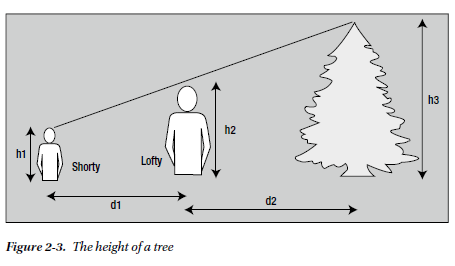
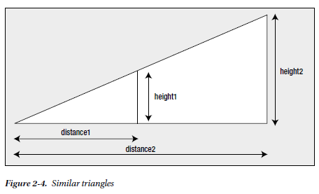

# Tree Height Problem

## The Problem

Your problem is to find out the height of a tree without using a very long ladder, which itself would introduce risk to life and limb.

To find the height of a tree, you’re allowed the help of a friend—preferably a short friend unless you yourself are short, in which
case you need a tall friend. You should assume that the tree you’re measuring is taller than both you and your friend.

## The Analysis

Real-world problems are rarely expressed in terms that are directly suitable for programming. Before you consider
writing a line of code, you need to be sure you have a complete understanding of the problem and how it’s going to be
solved. Only then can you estimate how much time and effort will be involved in creating the solution.

The analysis phase involves gaining a full understanding of the problem and determining the logical process for
solving it. Typically this requires a significant amount of work. It involves teasing out any detail in the specification
of the problem that is vague or missing. Only when you fully understand the problem can you begin to express the
solution in a form that’s suitable for programming.

You’re going to determine the height of a tree using some simple geometry and the heights of two people: you
and one other.

Let’s start by naming the tall person (you) Lofty and the shorter person (your friend) Shorty. If you’re
vertically challenged, the roles can be reversed. For more accurate results, the tall person should be significantly taller
than the short person. If they are not, the tall person could consider standing on a box. The diagram in Figure 2-3 will
give you an idea of what you’re trying to do in this program.

Finding the height of the tree is actually quite simple. You can get the height of the tree, h3, if you know the other
dimensions shown in the illustration: h1 and h2, which are the heights of Shorty and Lofty, and d1 and d2, which are the
distances between Shorty and Lofty and Lofty and the tree, respectively. You can use the technique of similar triangles
to work out the height of the tree. You can see this in the simplified diagram in Figure 2-4.

Here, because the triangles are similar, height1 divided by distance1 is equal to height2 divided by distance2.
Using this relationship, you can get the height of the tree from the height of Shorty and Lofty and the distances to the
tree, as shown in Figure 2-5.

The triangles ADE and ABC are the same as those shown in Figure 2-4. The triangles are similar, which just
means that if you divide the length of any side of one triangle by the length of the corresponding side of the other,
you’ll always get the same result. You can use this to calculate the height of the tree, as shown in the equation at the
bottom of Figure 2-5.

Thus you can calculate the height of the tree in your program from four values:

- The distance between Shorty and Lofty, d1 in the diagram. You’ll use the variable shorty_to_lofty to store this value.
- The distance between Lofty and the tree, d2 in the diagram. You’ll use the variable lofty_to_tree to store this value.
- The height of Lofty from the ground to the top of his head, h2 in the diagram. You’ll use the
variable lofty to store this value.
- The height of Shorty’s eyes from the ground, h1 in the diagram. You’ll use the variable shorty to store this value.

You can plug these values into the equation for the height of the tree.
Your first task in your program is to read these four values from the keyboard. You can then use your ratios to find
out the height of the tree and finally output the answer. The steps are as follows:

1. Read in the values you need.
2. Calculate the height of the tree using the equation in the Figure 2.5.
3. Display the answer.

## Step 1

Your first step is to get the values you need. This means you have to include the stdio.h header file, because you will
need to use both printf() and scanf(). First, you must define the variables that will store the input values. Then you
can use printf() to prompt for the input and scanf() to read the values from the keyboard.

You’ll provide for the heights of the participants to be entered in feet and inches for the convenience of the
user. Inside the program it will be easier to work with all heights and distances in the same units, so you’ll convert all
measurements to inches. You’ll need two variables to store the heights of Shorty and Lofty in inches. You’ll also need
variables to store the distance between Lofty and Shorty, and the distance from Lofty to the tree—both distances in inches.
In the input process, you’ll first read Lofty’s height as a number of whole feet and then the number of inches as
a second value, prompting for each value as you go along. You can use two more variables for this: one to store the
feet value and the other to store the inches value. You’ll then convert these into just inches and store the result in the
variable you’ve reserved for Lofty’s height. You’ll do the same thing for Shorty’s height (which is only up to the height
of his or her eyes) and finally you’ll read in the value for the distance between them. For the distance to the tree, you’ll
use only whole feet, because this will be accurate enough—and you’ll convert the distance to inches for calculation
purposes. You can reuse the same variables for each measurement in feet and inches that is entered.

## Step 2

Now that you have all the required data, you can calculate the height of the tree. You just need to express the equation
for the tree height in terms of your variables. You’ll need to declare another variable to store the height of the tree.

## Step 3

Finally, you need to output the height of the tree. To present the results in the most easily understandable form, you
can convert the results that you’ve stored in tree_height—which is in inches—back into feet and inches:
